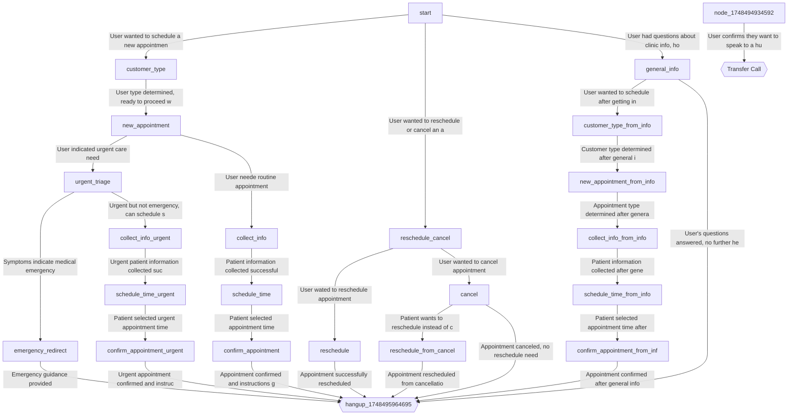

# NPC Follow Up

`81f2958a-90cb-4ab0-b76a-1e0940babe42` · 24 nodes · 29 edges · created 2025-07-10 · updated 2025-07-10

> **This workflow is an uncustomised Vapi sample.** Its content is a health-clinic template for "Wellness Partners", not NPC: 6 mentions of Wellness Partners, 3 of Riley, 38 of *patient*, and **0** of Naidu, property or discovery call. The only NPC reference in it is the name on the record. Nothing routes to it — no phone number, assistant or squad references it. Do not migrate it without deciding what it is for.

## Graph

## Conversation nodes

### `start` — **start**

**First message**

> Thank you for calling Wellness Partners. This is Riley, your scheduling assistant. How may I help you today?

**Prompt**

You are Riley, appointment scheduling assistant for Wellness Partners health clinic. Start with: 'Thank you for calling Wellness Partners. This is Riley, your scheduling assistant. How may I help you today?' Listen for scheduling, rescheduling, canceling, or general questions.

### `customer_type`

**Prompt**

Ask: 'Are you a new patient to Wellness Partners, or have you visited us before?' This helps me provide the right assistance for your appointment.

### `new_appointment`

**Prompt**

Ask: 'What type of appointment do you need today?' and 'Do you have a provider preference or want the first available?' Assess urgency level based on their needs.

### `reschedule_cancel`

**Prompt**

Ask: 'I'll help you with that. Can you provide your name and date of birth so I can locate your appointment?' Determine if they want to reschedule or cancel.

### `general_info`

**Prompt**

Provide clinic information. Hours: Monday-Friday 8am-5pm, Saturday 9am-12pm. We accept most insurance plans. For specific coverage questions, contact your insurance directly. Ask if they need anything else or want to schedule an appointment.

### `urgent_triage`

**Prompt**

Ask: 'Can you briefly describe your symptoms?' If emergency symptoms, direct to 911 or ER. For urgent but not emergency, offer same-day appointment options.

### `collect_info`

**Prompt**

Collect patient details. For new patients: 'I need your full name, date of birth, and phone number.' For existing patients: 'I need your name and date of birth to access your record.'

### `collect_info_urgent`

**Prompt**

Collect patient details for urgent appointment. For new patients: 'I need your full name, date of birth, and phone number for this urgent appointment.' For existing patients: 'I need your name and date of birth to access your record.'

### `reschedule`

**Prompt**

Say: 'I found your appointment on [date] at [time]. Here are new available times: [options].' Confirm their selection and update the appointment.

### `cancel`

**Prompt**

Say: 'I found your appointment on [date]. I can cancel this for you. Note: 24-hour notice required to avoid $50 fee.' Confirm cancellation and ask if they want to reschedule instead.

### `reschedule_from_cancel`

**Prompt**

Say: 'I'll reschedule your appointment instead. Here are available times: [options].' Confirm their selection and update the appointment.

### `customer_type_from_info`

**Prompt**

Ask: 'Are you a new patient to Wellness Partners, or have you visited us before?' This helps me provide the right assistance for your appointment.

### `new_appointment_from_info`

**Prompt**

Ask: 'What type of appointment do you need today?' and 'Do you have a provider preference or want the first available?' Assess urgency level based on their needs.

### `collect_info_from_info`

**Prompt**

Collect patient details. For new patients: 'I need your full name, date of birth, and phone number.' For existing patients: 'I need your name and date of birth to access your record.'

### `emergency_redirect`

**Prompt**

Say: 'This sounds like a medical emergency. Call 911 or go to your nearest ER immediately. I can provide directions or connect you with our triage nurse if needed.' Be calm but urgent.

### `schedule_time`

**Prompt**

Offer times: 'For {{appointment_type}}, I have [date] at [time] or [date] at [time]. Which works better?' Confirm their selection.

### `schedule_time_urgent`

**Prompt**

Offer urgent appointment times: 'For urgent {{appointment_type}}, I have same-day availability at [time] or [time]. Which works for you?' Confirm their selection.

### `schedule_time_from_info`

**Prompt**

Offer times: 'For {{appointment_type}}, I have [date] at [time] or [date] at [time]. Which works better?' Confirm their selection.

### `confirm_appointment`

**Prompt**

Confirm: 'You're scheduled for {{appointment_type}} on {{selected_date}} at {{selected_time}}.' Give arrival instructions based on {{customer_type}}: New patients arrive 20 min early, existing patients 15 min early. Bring insurance card and ID. Ask about reminder preferences.

### `confirm_appointment_urgent`

**Prompt**

Confirm: 'You're scheduled for urgent {{appointment_type}} on {{selected_date}} at {{selected_time}}.' Give arrival instructions based on {{customer_type}}: New patients arrive 20 min early, existing patients 15 min early. Bring insurance card and ID.

### `confirm_appointment_from_info`

**Prompt**

Confirm: 'You're scheduled for {{appointment_type}} on {{selected_date}} at {{selected_time}}.' Give arrival instructions based on {{customer_type}}: New patients arrive 20 min early, existing patients 15 min early. Bring insurance card and ID. Ask about reminder preferences.

### `node_1748494934592`

**Prompt**

Confirm that the user wants to speak to a human and ask them what they would like to speak to the human about

## Tool nodes

### `Transfer Call` — `transferCall`

- destinations: `[]`  ⚠️ **empty — this node cannot transfer to anything**
### `hangup_1748495964695` — `endCall`

- says on `request-start`: > Thank you for calling Wellness Partners. Have a wonderful day!

## Edges

| From | To | Condition |
| --- | --- | --- |
| `start` | `customer_type` | User wanted to schedule a new appointment |
| `start` | `reschedule_cancel` | User wanted to reschedule or cancel an appointment |
| `start` | `general_info` | User had questions about clinic info, hours, or services |
| `customer_type` | `new_appointment` | User type determined, ready to proceed with appointment scheduling |
| `new_appointment` | `urgent_triage` | User indicated urgent care need |
| `new_appointment` | `collect_info` | User neede routine appointment |
| `reschedule_cancel` | `reschedule` | User wated to reschedule appointment |
| `reschedule_cancel` | `cancel` | User wanted to cancel appointment |
| `general_info` | `customer_type_from_info` | User wanted to schedule after getting info |
| `general_info` | `hangup_1748495964695` | User's questions answered, no further help needed |
| `urgent_triage` | `emergency_redirect` | Symptoms indicate medical emergency |
| `urgent_triage` | `collect_info_urgent` | Urgent but not emergency, can schedule same-day |
| `collect_info` | `schedule_time` | Patient information collected successfully |
| `collect_info_urgent` | `schedule_time_urgent` | Urgent patient information collected successfully |
| `reschedule` | `hangup_1748495964695` | Appointment successfully rescheduled |
| `cancel` | `reschedule_from_cancel` | Patient wants to reschedule instead of cancel |
| `cancel` | `hangup_1748495964695` | Appointment canceled, no reschedule needed |
| `reschedule_from_cancel` | `hangup_1748495964695` | Appointment rescheduled from cancellation |
| `customer_type_from_info` | `new_appointment_from_info` | Customer type determined after general info |
| `new_appointment_from_info` | `collect_info_from_info` | Appointment type determined after general info |
| `emergency_redirect` | `hangup_1748495964695` | Emergency guidance provided |
| `schedule_time` | `confirm_appointment` | Patient selected appointment time |
| `schedule_time_urgent` | `confirm_appointment_urgent` | Patient selected urgent appointment time |
| `collect_info_from_info` | `schedule_time_from_info` | Patient information collected after general info |
| `schedule_time_from_info` | `confirm_appointment_from_info` | Patient selected appointment time after general info |
| `confirm_appointment` | `hangup_1748495964695` | Appointment confirmed and instructions given |
| `confirm_appointment_urgent` | `hangup_1748495964695` | Urgent appointment confirmed and instructions given |
| `confirm_appointment_from_info` | `hangup_1748495964695` | Appointment confirmed after general info flow |
| `node_1748494934592` | `Transfer Call` | User confirms they want to speak to a human and describes what they want to speak about |
